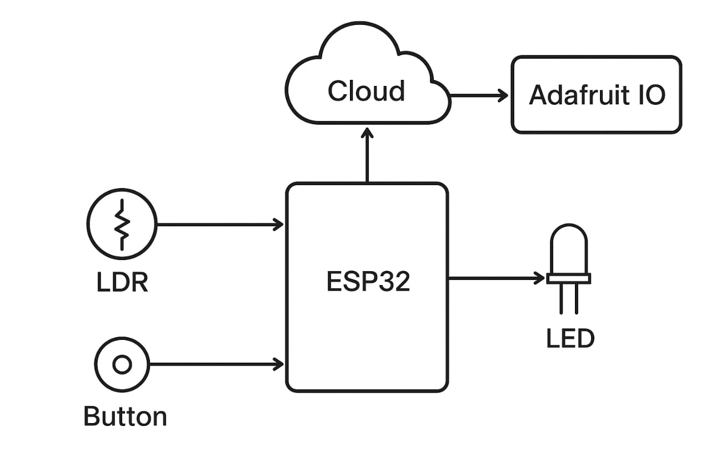
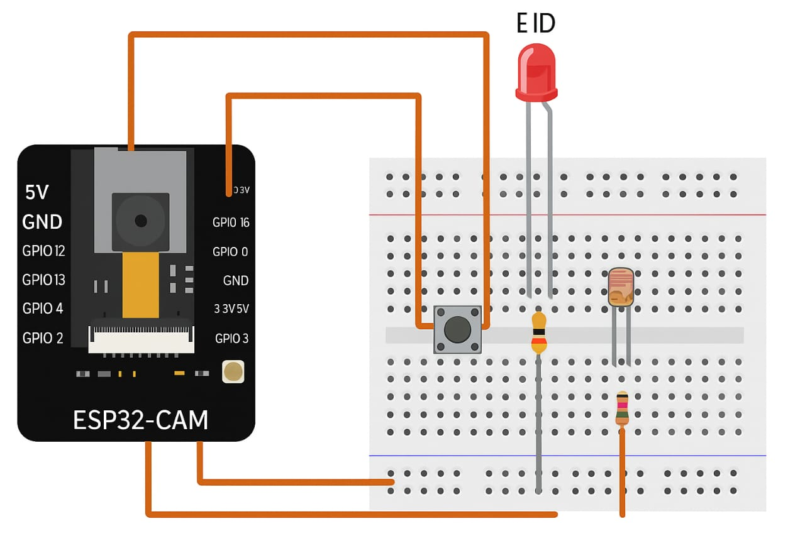
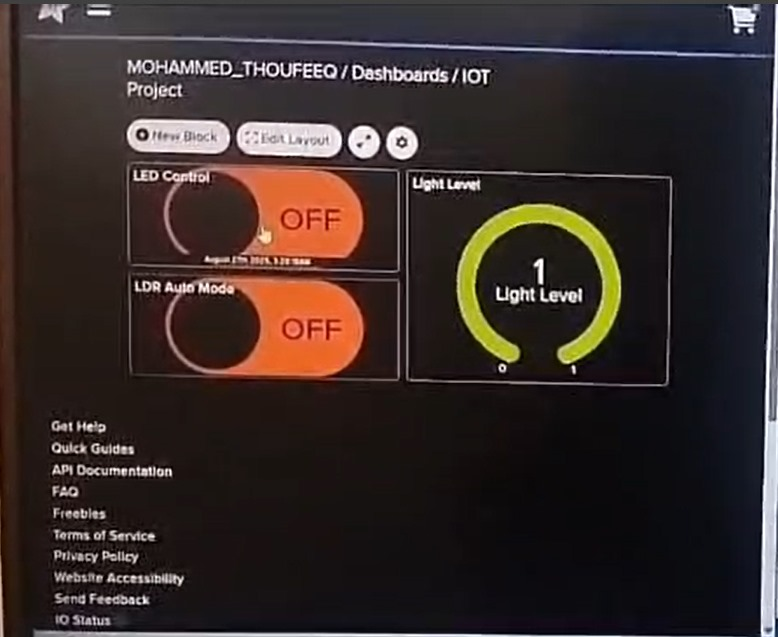
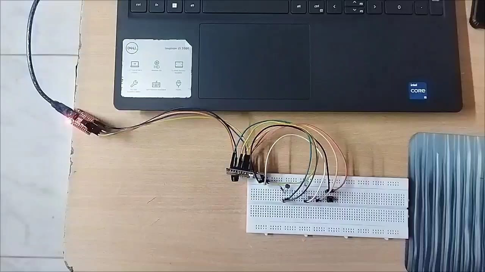
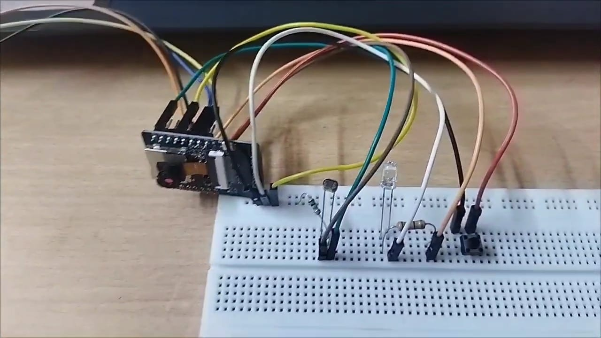

# IoT-Based Smart Home Automation System Using ESP32-CAM

An IoT-based smart home automation prototype developed using **ESP32-CAM**, **Wi-Fi**, **Adafruit IO**, an **LDR sensor**, a **pushbutton**, and an **LED**.

The system provides both manual and automatic lighting control. Users can control the LED through a connected interface or a physical pushbutton, while the LDR sensor enables automatic lighting based on ambient light conditions.

---

## Project Overview

Smart home automation combines embedded systems, wireless communication, and sensors to provide convenient and efficient control of household devices.

This project presents a low-cost smart home automation prototype using an **ESP32-CAM** as the main controller and Wi-Fi communication interface.

The system controls an LED representing a household light. It supports:

- Manual LED control using a pushbutton
- Remote LED control through the connected interface
- Automatic LED control using an LDR sensor
- Real-time status communication through Adafruit IO
- Wi-Fi-based communication
- Dashboard-based monitoring and control

The project was implemented and tested using a breadboard-based hardware prototype.

---

## Objectives

The main objectives of the project are:

1. To develop a Wi-Fi-enabled smart home automation system.
2. To control a household lighting load using an ESP32-CAM.
3. To provide manual control using a physical pushbutton.
4. To provide remote control through an IoT dashboard.
5. To implement automatic lighting control using an LDR sensor.
6. To demonstrate IoT-based monitoring and control using MQTT and Adafruit IO.

---

## System Features

### Manual Control

The LED can be controlled manually using a physical pushbutton.

Pressing the button toggles the LED between ON and OFF states.

### Remote Control

The LED can also be controlled through the connected IoT interface.

The ESP32-CAM communicates with the Adafruit IO MQTT service to receive control commands and synchronize the LED state.

### Automatic LDR Mode

An LDR sensor is used to detect ambient light conditions.

In automatic mode:

- When the environment is dark, the LED is turned ON.
- When the environment is bright, the LED is turned OFF.

### IoT Communication

The ESP32-CAM connects to a Wi-Fi network and communicates with Adafruit IO through MQTT.

The system uses separate feeds for LED control, LDR status, and LDR control.

### Status Monitoring

The system publishes LDR status information and synchronizes the LED state with the IoT dashboard.

---

## System Architecture

```text
                    ┌─────────────────┐
                    │   Adafruit IO   │
                    │    Dashboard    │
                    └────────┬────────┘
                             │
                         MQTT / Wi-Fi
                             │
                             ▼
                    ┌─────────────────┐
                    │    ESP32-CAM    │
                    │ Main Controller │
                    └───────┬─────────┘
                            │
             ┌──────────────┼──────────────┐
             │              │              │
             ▼              ▼              ▼
        ┌────────┐     ┌──────────┐    ┌────────┐
        │  LDR   │     │Pushbutton│    │  LED   │
        │ Sensor │     │  Input   │    │ Output │
        └────────┘     └──────────┘    └────────┘
```

---

## Hardware Components

The prototype uses the following main components:

| Component | Purpose |
|---|---|
| ESP32-CAM | Main controller and Wi-Fi interface |
| LDR Sensor | Ambient light detection |
| LED | Represents the controlled home light |
| Pushbutton | Manual LED control |
| Voltage Regulator | Provides regulated supply |
| Breadboard | Circuit prototyping |
| Jumper Wires | Electrical connections |
| Power Supply | Provides power to the system |

The project documentation identifies the ESP32-CAM, LED, pushbutton, LDR sensor, breadboard/jumper wires, power supply, and voltage regulation as the main hardware elements. :contentReference[oaicite:5]{index=5}

---

## ESP32-CAM

The ESP32-CAM acts as the main controller of the system.

It performs the following functions:

- Connects to Wi-Fi
- Communicates with Adafruit IO
- Receives LED control commands
- Receives LDR-mode commands
- Reads the LDR state
- Reads the pushbutton
- Controls the LED
- Publishes status information

The project documentation describes the ESP32-CAM as the main control unit and Wi-Fi interface for the smart-home prototype. :contentReference[oaicite:6]{index=6}

---

## Sensors and Inputs

### LDR Sensor

The LDR is used to detect ambient light intensity.

In automatic mode, the ESP32-CAM monitors the LDR state and changes the LED according to the detected environment.

```text
Dark Environment
       │
       ▼
   LDR Detection
       │
       ▼
    LED ON

Bright Environment
       │
       ▼
   LDR Detection
       │
       ▼
    LED OFF
```

The project documentation describes the same automatic-lighting concept using the LDR sensor. :contentReference[oaicite:7]{index=7}

### Pushbutton

The pushbutton provides manual control of the LED.

Each detected button press toggles the LED state.

---

## IoT Communication

The system uses:

```text
ESP32-CAM
     │
     ▼
   Wi-Fi
     │
     ▼
 MQTT
     │
     ▼
Adafruit IO
```

The Arduino program uses the Adafruit MQTT client library and connects to:

```text
io.adafruit.com
```

The project uses MQTT feeds for:

```text
led-control
ldr-status
ldr-control
```

These feeds are used for LED control, LDR status reporting, and enabling/disabling automatic LDR control. :contentReference[oaicite:8]{index=8}

---

## Software

### Development Environment

- Arduino IDE

### Programming Language

- C/C++ for Arduino

### Libraries

- WiFi
- Adafruit MQTT
- Adafruit MQTT Client

The project documentation identifies Arduino IDE as the development environment used to program and upload the ESP32-CAM application. :contentReference[oaicite:9]{index=9}

---

## Control Modes

The system supports two primary operating modes.

### 1. Manual Mode

In manual mode, the LED can be controlled by:

- Physical pushbutton
- IoT dashboard command

```text
Pushbutton ─────┐
                ├──► ESP32-CAM ───► LED
Dashboard ──────┘
```

### 2. Automatic Mode

In automatic mode, the LDR determines the LED state.

```text
LDR
 │
 ▼
ESP32-CAM
 │
 ├── Dark ──► LED ON
 │
 └── Bright ─► LED OFF
```

The implementation and results sections of the project documentation describe both manual and automatic operating cases. :contentReference[oaicite:10]{index=10} :contentReference[oaicite:11]{index=11}

---

## Software Logic

The main program performs the following operations:

```text
Start
 │
 ▼
Initialize GPIO
 │
 ▼
Connect to Wi-Fi
 │
 ▼
Connect to MQTT / Adafruit IO
 │
 ▼
Read cloud commands
 │
 ├───────────────┐
 │               │
 ▼               ▼
LED Control     LDR Control
 │               │
 ▼               ▼
Update LED      Enable/Disable
 │               │
 └───────┬───────┘
         │
         ▼
     Read Button
         │
         ▼
     Read LDR
         │
         ▼
Automatic LED Control
         │
         ▼
Publish Status
         │
         ▼
       Repeat
```

---

## MQTT Feeds

The implementation uses the following Adafruit IO feeds:

### `led-control`

Used to receive and publish LED control states.

Possible values include:

```text
ON
OFF
```

### `ldr-control`

Used to enable or disable automatic LDR operation.

Possible values include:

```text
ON
OFF
```

### `ldr-status`

Used to publish the detected LDR state.

The program publishes:

```text
1 = DARK
0 = BRIGHT
```

These feed definitions and behaviours are implemented directly in the source code. :contentReference[oaicite:12]{index=12} :contentReference[oaicite:13]{index=13}

---

## Protection and Control Logic

The program includes timing controls to avoid excessive or unstable switching and publishing.

These include:

- Minimum interval between Adafruit IO publishes
- Minimum gap between automatic LDR actions
- Cloud command echo suppression
- Temporary hold-off after manual/cloud LED changes

This helps prevent rapid repeated commands and unnecessary cloud updates.

---

## Project Images

### System Block Diagram



### Circuit Diagram



### Adafruit IO Dashboard



### Hardware Overview



### Hardware Setup



---

## Project Structure

```text
IoT-Smart-Home-Automation-ESP32/
│
├── README.md
│
├── src/
│   └── smart_home_automation.ino
│
├── documentation/
│   └── Smart-Home-Automation-Using-ESP32-CAM.pdf
│
└── images/
    ├── smart-home-block-diagram.jpeg
    ├── smart-home-circuit-diagram.jpeg
    ├── smart-home-dashboard.jpeg
    ├── smart-home-hardware-overview.jpeg
    └── smart-home-hardware-setup.jpeg
```

---

## Source Code

The main Arduino program is available at:

```text
src/smart_home_automation.ino
```

The public GitHub version uses placeholder values for Wi-Fi and Adafruit IO credentials.

Before running the program, replace:

```cpp
#define WIFI_SSID    "YOUR_WIFI_SSID"
#define WIFI_PASS    "YOUR_WIFI_PASSWORD"

#define IO_USERNAME  "YOUR_ADAFRUIT_IO_USERNAME"
#define IO_KEY       "YOUR_ADAFRUIT_IO_KEY"
```

with your own local credentials.

**Do not commit real passwords, API keys, or other private credentials to a public repository.**

---

## Installation

### 1. Install Arduino IDE

Install a compatible Arduino IDE environment for ESP32 development.

### 2. Install ESP32 Board Support

Add the ESP32 board package to Arduino IDE.

### 3. Install Required Libraries

Install:

```text
Adafruit MQTT
```

The Wi-Fi functionality is provided by the ESP32 Wi-Fi library.

### 4. Configure Credentials

Update the placeholders in:

```text
src/smart_home_automation.ino
```

with your local Wi-Fi and Adafruit IO credentials.

### 5. Select the ESP32-CAM Board

Select the appropriate ESP32-CAM board configuration in Arduino IDE.

### 6. Upload the Program

Connect the ESP32-CAM to your programming interface and upload the sketch.

---

## Running the Project

After uploading:

1. Power the ESP32-CAM.
2. Connect it to the configured Wi-Fi network.
3. Verify that it connects successfully.
4. Open the Adafruit IO dashboard.
5. Control the LED through the dashboard.
6. Enable LDR automatic mode when required.
7. Test the physical pushbutton.
8. Observe the LDR status and LED response.

---

## Results

The prototype was tested in both manual and automatic operating modes.

### Manual Operation

The LED can be controlled using the pushbutton or through the connected web/IoT interface.

### Automatic Operation

The LDR detects ambient light conditions and controls the LED accordingly.

```text
Low Light  → LED ON

Bright Light → LED OFF
```

The project documentation reports successful operation of both manual and automatic lighting control using the ESP32-CAM. :contentReference[oaicite:14]{index=14}

---

## Advantages

- Wi-Fi-based remote control
- Automatic lighting based on ambient conditions
- Manual override using pushbutton
- Real-time IoT communication
- Low-cost prototype
- Easy to expand with additional sensors
- Suitable for embedded IoT experimentation

---

## Possible Extensions

The current prototype can be extended with:

- Additional lighting channels
- Fan or appliance control
- Motion sensors
- Temperature and humidity monitoring
- Door and window monitoring
- Additional IoT dashboard controls
- Security-related sensors
- Energy monitoring
- More automated home appliances

The project documentation also identifies future expansion with additional sensors, appliances, security modules, and energy-management features. :contentReference[oaicite:15]{index=15}

---

## Project Documentation

The complete project paper is available in:

```text
documentation/Smart-Home-Automation-Using-ESP32-CAM.pdf
```

It contains the project introduction, system analysis, hardware description, software description, implementation, results, conclusion, and references. :contentReference[oaicite:16]{index=16}

---

## Project Status

**Status:** Completed Prototype

The repository contains:

- Source code
- Project documentation
- System diagrams
- Circuit diagram
- Hardware photographs
- IoT dashboard screenshot

---

## Author

**Mohammed Thoufeeq Ali S M**

B.S. Abdur Rahman Crescent Institute of Science and Technology

GitHub:  
https://github.com/MdThoufeeq

---

## Repository

IoT-Based Smart Home Automation System using ESP32-CAM

```text
https://github.com/MdThoufeeq/IoT-Smart-Home-Automation-ESP32
```

---

## License

No specific open-source license has been added to this repository at this time.
